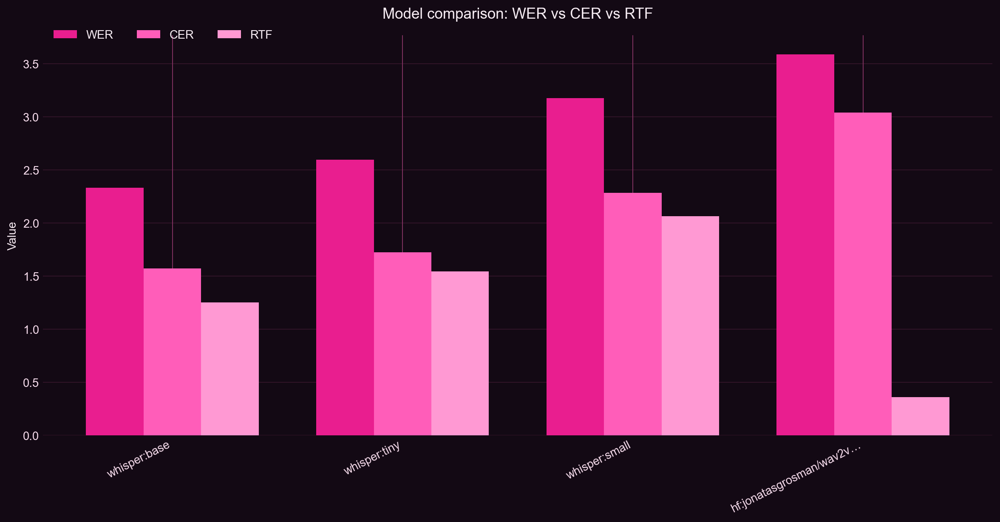
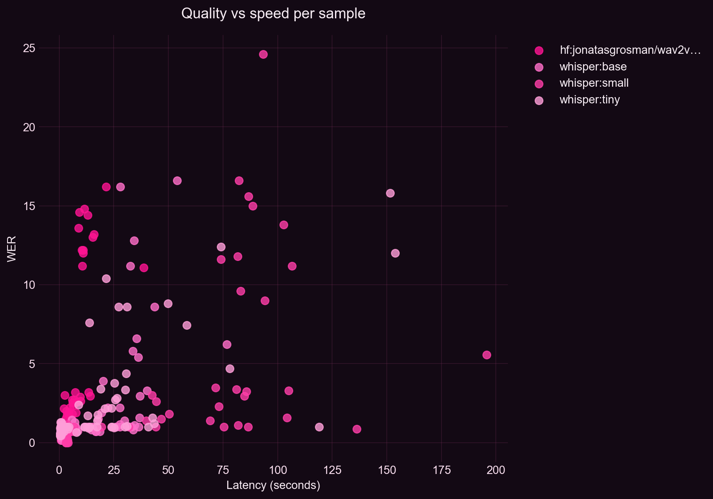
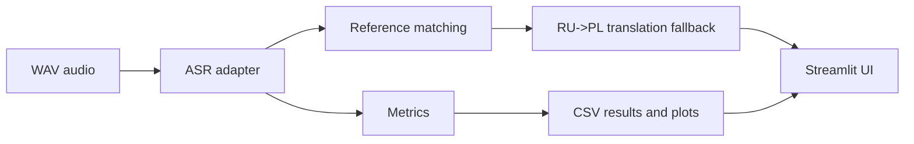

# RU-PL Speech Translation

End-to-end Python application for benchmarking Russian ASR models on challenging
tongue-twister recordings and translating recognized speech into Polish. The
project compares Whisper and Wav2Vec2 with WER/CER, token F1, exact match, and
inference-time metrics. It also provides an interactive Streamlit interface for
single-file audio analysis and model comparison.

Project Presentation: [View presentation (PDF)](docs/presentation.pdf)



## Example Results

Example benchmark run: `run_20260527_203830`, 58 WAV samples.
Lower WER/CER and inference time are better; higher token F1 is better.

| Model | WER | CER | Token F1 | Avg inference time |
| --- | ---: | ---: | ---: | ---: |
| Whisper Small | 0.686 | 0.434 | 0.398 | 91.50 s |
| Whisper Base | 0.858 | 0.572 | 0.222 | 15.02 s |
| Wav2Vec2 XLSR Russian | 0.865 | 0.468 | 0.439 | 3.71 s |
| Whisper Tiny | 1.181 | 0.939 | 0.180 | 12.79 s |

Whisper Small produced the best WER in this run, while Wav2Vec2 was the fastest
model and achieved the strongest token F1. The hardest samples were the longest
and most repetitive tongue twisters, especially `tri_kitajca`, `sasha`, `carl`,
`skorogovorun`, and `salo`, where dense names and near-repeated syllables caused
insertions, substitutions, and language drift.

The tracked example leaderboard is available in
[reports/example_results/leaderboard.csv](reports/example_results/leaderboard.csv).



## What It Does

- Benchmarks Russian ASR models on `.wav` tongue-twister recordings.
- Computes WER, CER, token precision/recall/F1, exact match, latency, RTF, and memory.
- Runs a Streamlit UI with single-file analysis and model-comparison views.
- Uses a Russian/Polish reference catalog for known recordings.
- Resolves Polish output with a robust fallback pipeline:
  `filename reference -> transcript similarity matching -> neural RU->PL translation`.
- Saves leaderboard CSV files and benchmark plots for reproducible comparison.

## Architecture



Main modules:

| Area | Files |
| --- | --- |
| ASR adapters | `src/benchmarking/models/` |
| Benchmark runner and CLI | `src/benchmarking/runner.py`, `src/benchmarking/cli.py` |
| Metrics and reporting | `src/benchmarking/metrics.py`, `src/benchmarking/reporting.py` |
| Dataset loading | `src/benchmarking/dataset.py` |
| Reference catalog | `src/reference_texts.py`, `data/reference_texts/` |
| Analysis and translation flow | `src/ui/analysis_engine.py`, `src/ui/translation_engine.py` |
| Streamlit UI | `src/app.py`, `src/ui/` |

## Models And Evaluation

ASR models are configured in [configs/models.yaml](configs/models.yaml):

- `whisper:tiny`
- `whisper:base`
- `whisper:small`
- `hf:jonatasgrosman/wav2vec2-large-xlsr-53-russian`

Translation:

- NLLB RU->PL: `facebook/nllb-200-distilled-600M`

Evaluation:

- WER and CER for transcription errors,
- token precision, recall, and F1 for overlap quality,
- exact match for strict correctness,
- latency, real-time factor, and peak memory for runtime trade-offs.

## Screenshots

Benchmark charts generated by the pipeline:


Recommended additions before publishing:

```text
docs/assets/screenshots/analysis.png
docs/assets/screenshots/model-comparison.png
docs/assets/demo/app-demo.gif
```

## Quick Start

Create and activate a virtual environment:

```powershell
py -3.10 -m venv .venv
.\.venv\Scripts\Activate.ps1
python -m pip install --upgrade pip
pip install -r requirements.txt
```

Install optional ASR and translation backends when you want the full app:

```powershell
pip install openai-whisper transformers torch sentencepiece
```

Optional Hugging Face token:

```env
HF_TOKEN=hf_xxx_your_read_token
RU_PL_TRANSLATION_MODEL_ID=facebook/nllb-200-distilled-600M
```

Run the Streamlit app:

```powershell
streamlit run src/app.py
```

Run the benchmark from CLI:

```powershell
python main.py benchmark --data-dir data/raw
```

After editable install you can also use:

```powershell
pip install -e .
asr-benchmark benchmark --data-dir data/raw
```

## App Modes

**Analysis**

Upload a `.wav` file and the app will:

- render an audio player and waveform preview,
- match the file against the reference catalog when possible,
- transcribe Russian speech with Whisper,
- display recognized words with confidence bars,
- resolve Polish output from catalog, text similarity, or model translation.

**Model Comparison**

Run the benchmark on `data/raw` and inspect:

- leaderboard table,
- interactive Plotly charts,
- saved PNG plots,
- detailed per-sample CSV output.

## Dataset Contract

The benchmark loader scans `data/raw` recursively and expects `.wav` audio files.
Files without reference text are skipped.

Reference text can come from:

1. `labels.csv`, `references.csv`, or `metadata.csv` in `data/raw`,
2. sidecar `.txt` files next to audio files,
3. `data/reference_texts` catalog matched by normalized file name.

Example CSV:

```csv
file_name,reference_text
person1/carl.wav,Karl u Klary ukral korally
```

Large datasets, private recordings, and model caches are intentionally not
tracked in Git. If recordings contain real voices, publish only samples that are
cleared for public use and keep the full dataset private or access-controlled.

## Outputs

CLI benchmark output:

```text
reports/results/run_<timestamp>/
```

Streamlit comparison output:

```text
src/ui/model_comparison/results/run_<timestamp>/
```

Each complete run contains:

- `detailed_results.csv`
- `leaderboard.csv`
- `plots/01_overview_metrics.png`
- `plots/02_quality_vs_speed.png`
- `plots/03_wer_boxplot.png`
- `plots/04_model_heatmap.png`

## Repository Layout

```text
configs/                 benchmark model config
data/raw/                local audio dataset (ignored except .gitkeep)
data/reference_texts/    RU/PL reference catalog
docs/presentation.pdf    project presentation
reports/example_results/ tracked benchmark summary for README
reports/results/         CLI benchmark outputs (ignored except .gitkeep)
src/app.py               Streamlit entrypoint
src/benchmarking/        dataset loading, models, metrics, reporting, CLI
src/ui/                  Streamlit UI and analysis flow
tests/benchmarking/      unit tests mirroring src/benchmarking modules
tests/ui/                unit tests for UI-adjacent pure logic
tests/                   unit tests for root-level src modules
```

## Development

Install development dependencies:

```powershell
pip install -e ".[dev]"
```

Run tests:

```powershell
pytest
```

Check syntax without running models:

```powershell
python -m compileall main.py src tests
```

Run linting:

```powershell
ruff check .
```

## CI

The GitHub Actions workflow runs dependency installation, Ruff, unit tests, and
syntax checks. It intentionally does not download Whisper, Wav2Vec2, NLLB, or the
private audio dataset; full model inference stays as a local/manual integration
test.

## Notes

- `models_cache/` is ignored because Whisper and Hugging Face downloads can be large.
- `.env` is ignored and should never be committed.
- Generated benchmark runs stay out of Git except curated files in `reports/example_results/`.
- First model run can be slow because weights are downloaded.
- CPU inference works, but larger models can be slow; use `--device cuda` when available.
